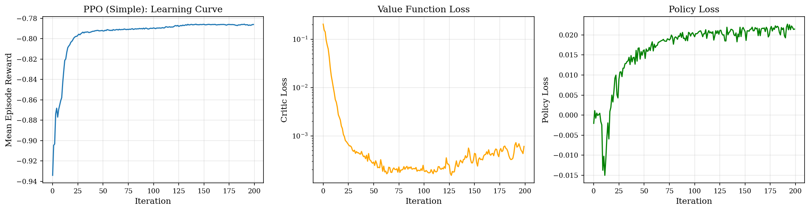
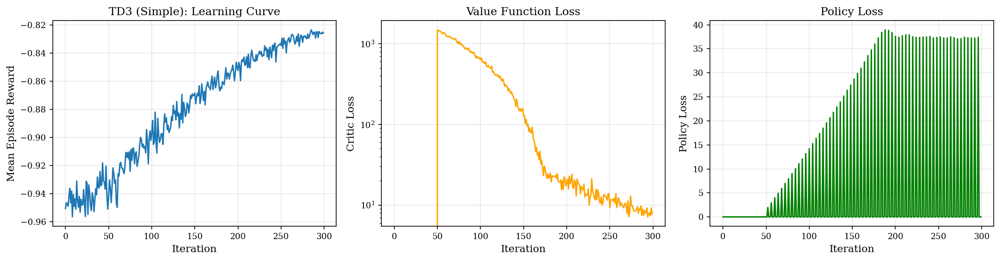
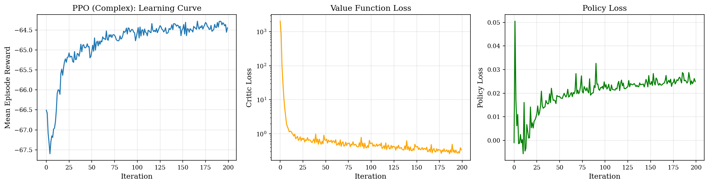

# Flash Calciner Control

Authors: Alexandre Fournier, Simon Pino-Buisson, Justin Veilleux

## Which algorithms you implemented and how

All three algorithms were implemented in a way that is environment agnostic, but
PPO was chosen for the large environment because it was the most stable
algorithm on the small environments.

For the training on the large environment, the following hyperparameters were
chosen:

- $\lambda = 1.0$ 
- $\gamma = 0.99$
- batch size: 64
- Learning rate: 3e-4
- Entropy regularization coefficient: 0.01
- steps per batch: 10

The model itself was simply a 3 layers MLP with 256 hidden units.

## Learning curves

### REINFORCE (simple)

### PPO (simple)

### TD3 (simple)

### PPO (140D)

## Final performance metrics

| Method             | Reward          | Energy | Violations | Final α |
|--------------------|-----------------|--------|------------|---------|
| Baseline (Simple)  | -31.67 ± 0.00   | 15.32  | 30.0       | 0.9373  |
| REINFORCE          | -33.40 ± 0.00   | 16.69  | 18.0       | 0.9951  |
| PPO (Simple)       | -31.40 ± 0.00   | 15.30  | 30.0       | 0.9044  |
| TD3                | -31.82 ± 0.00   | 15.56  | 30.0       | 0.9686  |
| Baseline (Complex) | -3297.64 ± 0.00 | 44.44  | 50.0       | 0.8743  |
| PPO (Complex)      | -3234.47 ± 0.00 | 6.82   | 50.0       | 0.7289  |

The complex learned policy barely beat the baseline and managed to do so by
using the minimum temperature and thereby drastically reducing energy use.

## Does the policy exploit spacial structure.

The policy can't exploit spatial structure as it is a simple mlp and any
permutation of the components would be as easily learnable by the policy.

